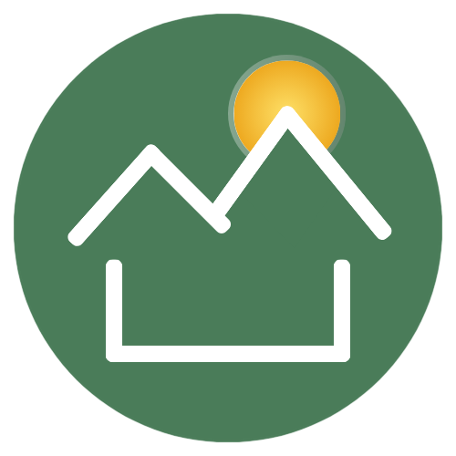

  

# MendoMarket

## Introducción

**MendoMarket** es una aplicación móvil innovadora diseñada para transformar la manera en que las personas compran y venden productos y servicios en la región de Mendoza. El objetivo principal de la app es crear un marketplace local, moderno y seguro, donde cualquier usuario pueda descubrir, publicar, buscar y adquirir productos de una amplia variedad de categorías, todo desde la comodidad de su dispositivo móvil.

La aplicación está pensada tanto para pequeños emprendedores y comercios locales que buscan una plataforma digital para ofrecer sus productos, como para compradores que desean encontrar oportunidades, comparar opciones y contactar fácilmente a los vendedores. MendoMarket fomenta la economía local, impulsa la digitalización de los negocios y facilita la conexión entre personas de la comunidad.

## ¿Para qué se va a utilizar?

MendoMarket servirá como un punto de encuentro digital para:

- 🛒 **Vendedores locales:** Permite publicar productos, gestionar su perfil y recibir consultas de potenciales compradores.
- 🔍 **Compradores:** Ofrece herramientas para explorar productos por categorías, buscar artículos específicos, guardar favoritos y contactar a los vendedores.
- 🚀 **Emprendedores:** Brinda visibilidad a nuevos negocios y productos, ayudando a crecer a la comunidad emprendedora de Mendoza.
- 🤝 **Usuarios en general:** Facilita la compra-venta de productos de segunda mano, servicios y artículos nuevos, todo en un entorno seguro y fácil de usar.

## Características principales

- 🚀 **Onboarding amigable:** Presentación clara de la app y sus beneficios para nuevos usuarios.
- 🔒 **Registro e inicio de sesión:** Seguridad y facilidad para crear una cuenta o acceder con credenciales.
- 🗂️ **Navegación por categorías:** Acceso rápido a productos organizados en categorías como moda, tecnología, hogar, deportes, libros, artesanías y más.
- 🔎 **Búsqueda avanzada:** Encuentra productos por nombre, categoría o palabras clave.
- ⭐ **Favoritos:** Guarda productos de interés para revisarlos más tarde.
- 👤 **Perfil de usuario:** Gestión de datos personales y publicaciones.
- 🔔 **Notificaciones:** Mantente informado sobre novedades, mensajes y actualizaciones.
- 💬 **Chat (en desarrollo):** Comunicación directa entre compradores y vendedores para consultas y negociaciones.
- 🔗 **Integración con Google (en desarrollo):** Opción de autenticación rápida y segura.

## Tecnologías utilizadas

- **Frontend:**  
  - Flutter (Dart) para el desarrollo de la app móvil multiplataforma.
  - Paquetes como `http` para la comunicación con el backend y `font_awesome_flutter` para iconografía moderna.
- **Backend:**  
  - FastAPI (Python) para la API REST.
  - SQLAlchemy para la gestión de la base de datos.
  - PostgreSQL como sistema de base de datos.
  - Docker y Docker Compose para el despliegue y la portabilidad de los servicios.

## ¿Cómo funciona?

1. El usuario descarga y abre la app, visualizando una introducción y las principales ventajas de MendoMarket.
2. Puede registrarse o iniciar sesión para acceder a todas las funcionalidades.
3. Desde la pantalla principal, explora productos destacados, accede a categorías o utiliza la búsqueda.
4. Puede ver detalles de productos, agregarlos a favoritos, y contactar a los vendedores (próximamente mediante chat).
5. Recibe notificaciones sobre novedades, mensajes y actualizaciones relevantes.
6. Los vendedores pueden gestionar sus publicaciones y responder consultas de los compradores.

## Valor diferencial

- 🌎 **Enfoque local:** Pensada especialmente para la comunidad de Mendoza, promoviendo el comercio de cercanía.
- 🧩 **Facilidad de uso:** Interfaz intuitiva y moderna, accesible para todo tipo de usuarios.
- 📈 **Escalabilidad:** Arquitectura preparada para crecer y sumar nuevas funcionalidades.
- 🔐 **Seguridad:** Manejo responsable de los datos y autenticación segura.